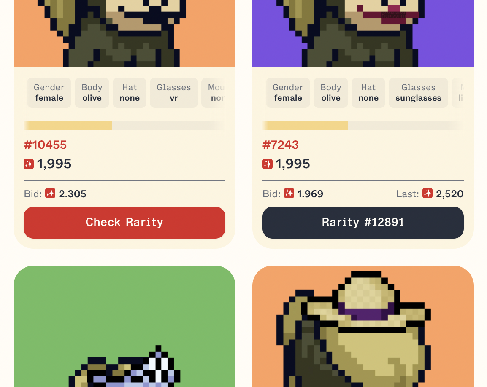

# Treasure Rarity Checker

Check rarity rating on supported collections from [treasure.tools](https://treasure.tools) while scrolling Trove. 

Easy peasy 🍋 squeezy.

## Requirements
- Google Chrome or Brave Browser

## Install
1. [Download Extension](https://github.com/goldendilemma/treasure-rarity-extension/archive/refs/heads/main.zip)
2. Unzip files
3. Launch web browser
4. Navigate to `chrome://extensions` by copy & pasting link into your url bar
5. Enable developer mode in the top right corner ([screenshot](docs/images/enable-developer-mode.png))
6. Press `Load unpacked` to the top left ([screenshot](docs/images/load-unpacked.png))
7. Navigate to the unzipped folder from `2.` ([screenshot](docs/images/select-folder.png))

🎉 It's done. Check if it works by visiting a [supported Trove collection](https://trove.treasure.lol/collection/smol-brains). 

## Alternatives

### Run script manually

1. Copy content of script in `src/injectTrove.cs.js`
2. Open up desired collection on [Trove](https://trove.treasure.lol/)
3. Open Developer Console
4. Paste script into `console`
5. Press enter, badabingbadabong.

## Support & PRs
I will try to keep the extension up-to-date on my spare-time.

Feel free to help out and maintain this extension. I will gladly go through any PR. ✌️

## Acknowledgements
- Thanks to [Treasure Tools](https://treasure.tools/) for supplying API with rarity data. 🫂